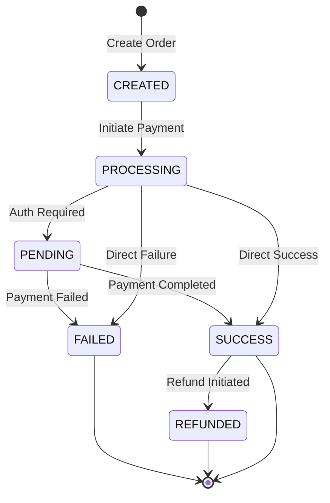

# E-commerce Online Payment Integration Guide

## Table of Contents
1. [Overview](#overview)
2. [Quick Start](#quick-start)
3. [End-to-End Payment Flow](#end-to-end-payment-flow)
4. [Integration Steps](#integration-steps)
5. [API Endpoints](#api-endpoints)
6. [Code Examples](#code-examples)
7. [Testing](#testing)
8. [Error Handling](#error-handling)
9. [Security Best Practices](#security-best-practices)
10. [Troubleshooting](#troubleshooting)

## Overview

This guide provides comprehensive instructions for integrating the Payment Gateway APIs into your e-commerce platform. The gateway supports multiple payment methods including UPI, cards, net banking, wallets, and more.

### Supported Payment Methods
- **UPI** - PhonePe, Google Pay, Paytm UPI
- **Credit/Debit Cards** - Visa, Mastercard, Amex, Rupay
- **Net Banking** - All major banks
- **Digital Wallets** - Paytm, PhonePe, Amazon Pay, Google Pay
- **BNPL** - Buy Now Pay Later options
- **EMI** - Easy installment plans

### Key Features
- Real-time payment processing
- Automatic payment status updates
- Webhook notifications
- Secure PCI-DSS compliant
- Multi-currency support
- 99.99% uptime SLA

## Quick Start

### Prerequisites
1. Active merchant account with API credentials
2. API Key and API Secret
3. Webhook endpoint configured on your server

### Environment Setup
```bash
# Production
BASE_URL=https://api.paymentgateway.com/v1

# Staging (for testing)
BASE_URL=https://staging-api.paymentgateway.com/v1
```

### Authentication
All API requests require JWT token in the Authorization header:
```
Authorization: Bearer <your-jwt-token>
```

## End-to-End Payment Flow

### Flow Diagram

```
┌─────────────┐                                    ┌──────────────┐
│  Customer   │                                    │  E-commerce  │
│   Browser   │                                    │    Server    │
└──────┬──────┘                                    └──────┬───────┘
       │                                                  │
       │  1. Select Items & Checkout                     │
       │─────────────────────────────────────────────────>│
       │                                                  │
       │                                                  │  2. Create Payment Order
       │                                                  │  POST /api/payin/orders
       │                                                  │───────────┐
       │                                                  │           │
       │                                                  │<──────────┘
       │                                                  │
       │  3. Show Payment Page                           │
       │<─────────────────────────────────────────────────│
       │     (with orderId & payment options)            │
       │                                                  │
       │                                                  │
       │  4. Select Payment Method & Enter Details       │
       │  (UPI/Card/NetBanking/Wallet)                  │
       │                                                  │
       │  5. Submit Payment                              │
       │─────────────────────────────────────────────────>│
       │                                                  │
       │                                                  │  6. Process Payment
       │                                                  │  POST /api/payin/orders/:orderId/pay
       │                                                  │───────────┐
       │                                                  │           │
       │                                                  │<──────────┘
       │                                                  │
       │  7. Redirect to Payment Gateway                 │
       │<─────────────────────────────────────────────────│
       │                                                  │
┌──────┴──────┐                                          │
│   Payment   │                                          │
│   Gateway   │                                          │
└──────┬──────┘                                          │
       │                                                  │
       │  8. Authenticate & Process                      │
       │  (Bank/UPI App/Wallet)                         │
       │                                                  │
       │  9. Payment Success/Failure                     │
       │──────────────────────────────────────────────────>
       │                                                  │
       │                                                  │  10. Webhook Notification
       │                                                  │  POST <merchant-webhook-url>
       │                                                  │<─────────┐
       │                                                  │          │
       │                                                  │──────────>
       │                                                  │
       │  11. Redirect to Merchant Success/Failure Page  │
       │<─────────────────────────────────────────────────│
       │                                                  │
       │                                                  │  12. Check Payment Status
       │                                                  │  GET /api/payin/orders/:orderId/status
       │                                                  │───────────┐
       │                                                  │           │
       │                                                  │<──────────┘
       │                                                  │
       │  13. Show Order Confirmation                    │
       │<─────────────────────────────────────────────────│
       │                                                  │
```

### Payment Flow States



## Integration Steps

### Step 1: Obtain API Credentials

1. Sign up for a merchant account
2. Complete KYC verification
3. Retrieve your API credentials from the dashboard:
   - API Key
   - API Secret
   - Webhook Secret

### Step 2: Implement Authentication

Generate JWT token using your API credentials:

```javascript
// Backend code to generate JWT token
const jwt = require('jsonwebtoken');

function generateAuthToken() {
  const payload = {
    apiKey: 'your-api-key',
    timestamp: Date.now()
  };
  
  const token = jwt.sign(payload, 'your-api-secret', {
    expiresIn: '1h'
  });
  
  return token;
}
```

### Step 3: Create Payment Order

When customer initiates checkout, create a payment order:

**Request:**
```bash
POST /api/payin/orders
Authorization: Bearer <jwt-token>
Content-Type: application/json

{
  "amount": 999.00,
  "currency": "INR",
  "customerId": "CUST_123456",
  "customerEmail": "customer@example.com",
  "customerPhone": "+919876543210",
  "description": "Order #12345 - Electronics Purchase",
  "orderId": "ORDER_12345",
  "callbackUrl": "https://yourstore.com/payment/callback",
  "paymentMethods": ["upi", "card", "netbanking", "wallet"]
}
```

**Response:**
```json
{
  "success": true,
  "orderId": "ORDER_12345",
  "amount": 999.00,
  "currency": "INR",
  "status": "CREATED",
  "paymentMethods": ["upi", "card", "netbanking", "wallet"],
  "expiryTime": "2024-01-01T12:30:00.000Z"
}
```

### Step 4: Display Payment Page

Show the payment page with available payment methods:

```html
<!DOCTYPE html>
<html>
<head>
    <title>Complete Payment</title>
</head>
<body>
    <h2>Complete Your Payment</h2>
    <p>Order ID: <span id="orderId">ORDER_12345</span></p>
    <p>Amount: ₹<span id="amount">999.00</span></p>
    
    <div class="payment-methods">
        <button onclick="selectPaymentMethod('upi')">UPI</button>
        <button onclick="selectPaymentMethod('card')">Card</button>
        <button onclick="selectPaymentMethod('netbanking')">Net Banking</button>
        <button onclick="selectPaymentMethod('wallet')">Wallet</button>
    </div>
    
    <div id="paymentForm"></div>
</body>
</html>
```

### Step 5: Process Payment

Submit payment details based on selected method:

#### UPI Payment
```bash
POST /api/payin/orders/ORDER_12345/pay
Authorization: Bearer <jwt-token>
Content-Type: application/json

{
  "paymentMethod": "upi",
  "paymentDetails": {
    "vpa": "customer@upi"
  }
}
```

#### Card Payment
```bash
POST /api/payin/orders/ORDER_12345/pay
Authorization: Bearer <jwt-token>
Content-Type: application/json

{
  "paymentMethod": "card",
  "paymentDetails": {
    "cardNumber": "4111111111111111",
    "cardholderName": "John Doe",
    "expiryMonth": "12",
    "expiryYear": "2025",
    "cvv": "123"
  }
}
```

#### Net Banking
```bash
POST /api/payin/orders/ORDER_12345/pay
Authorization: Bearer <jwt-token>
Content-Type: application/json

{
  "paymentMethod": "netbanking",
  "paymentDetails": {
    "bankCode": "HDFC"
  }
}
```

**Response:**
```json
{
  "success": true,
  "orderId": "ORDER_12345",
  "transactionId": "TXN_789012",
  "status": "PROCESSING",
  "redirectUrl": "https://bank.com/payment-auth",
  "timestamp": "2024-01-01T12:00:00.000Z"
}
```

### Step 6: Handle Redirect & Callback

1. **Customer Redirect**: Redirect customer to `redirectUrl` for authentication
2. **Webhook Callback**: Receive payment status update on your webhook endpoint

**Webhook Payload:**
```json
{
  "event": "payment.success",
  "orderId": "ORDER_12345",
  "transactionId": "TXN_789012",
  "status": "SUCCESS",
  "amount": 999.00,
  "currency": "INR",
  "timestamp": "2024-01-01T12:05:00.000Z",
  "signature": "hmac-sha256-signature"
}
```

**Webhook Implementation:**
```javascript
// Express.js webhook handler
app.post('/payment/webhook', async (req, res) => {
  try {
    // 1. Verify webhook signature
    const isValid = verifyWebhookSignature(
      req.body,
      req.headers['x-webhook-signature']
    );
    
    if (!isValid) {
      return res.status(401).json({ error: 'Invalid signature' });
    }
    
    // 2. Process webhook
    const { event, orderId, status, transactionId } = req.body;
    
    if (event === 'payment.success') {
      // Update order status in your database
      await updateOrderStatus(orderId, 'PAID', transactionId);
      
      // Trigger order fulfillment
      await fulfillOrder(orderId);
    } else if (event === 'payment.failed') {
      // Update order status
      await updateOrderStatus(orderId, 'FAILED', transactionId);
    }
    
    // 3. Acknowledge webhook
    res.json({ acknowledged: true });
    
  } catch (error) {
    console.error('Webhook error:', error);
    res.status(500).json({ error: 'Webhook processing failed' });
  }
});

function verifyWebhookSignature(payload, signature) {
  const crypto = require('crypto');
  const webhookSecret = 'your-webhook-secret';
  
  const expectedSignature = crypto
    .createHmac('sha256', webhookSecret)
    .update(JSON.stringify(payload))
    .digest('hex');
  
  return signature === expectedSignature;
}
```

### Step 7: Check Payment Status

Verify payment status after callback:

```bash
GET /api/payin/orders/ORDER_12345/status
Authorization: Bearer <jwt-token>
```

**Response:**
```json
{
  "orderId": "ORDER_12345",
  "status": "SUCCESS",
  "amount": 999.00,
  "currency": "INR",
  "transactionId": "TXN_789012",
  "timestamp": "2024-01-01T12:05:00.000Z"
}
```

### Step 8: Handle Refunds (if needed)

```bash
POST /api/payments/TXN_789012/refund
Authorization: Bearer <jwt-token>
Content-Type: application/json

{
  "amount": 999.00,
  "reason": "Customer requested refund"
}
```

## API Endpoints

### Order Management

| Method | Endpoint | Description |
|--------|----------|-------------|
| POST | `/api/payin/orders` | Create payment order |
| POST | `/api/payin/orders/:orderId/pay` | Process payment |
| GET | `/api/payin/orders/:orderId/status` | Get payment status |

### Payment Methods

| Method | Endpoint | Description |
|--------|----------|-------------|
| POST | `/api/upi/validate-vpa` | Validate UPI VPA |
| POST | `/api/upi/collect` | Create UPI collect request |
| POST | `/api/upi/qr/generate` | Generate UPI QR code |

### Transaction Management

| Method | Endpoint | Description |
|--------|----------|-------------|
| GET | `/api/payments/:transactionId` | Get transaction details |
| POST | `/api/payments/:transactionId/refund` | Process refund |

### Webhooks

| Event | Description |
|-------|-------------|
| `payment.created` | Order created |
| `payment.processing` | Payment initiated |
| `payment.success` | Payment successful |
| `payment.failed` | Payment failed |
| `refund.initiated` | Refund started |
| `refund.completed` | Refund completed |

## Code Examples

### Complete Node.js Integration Example

```javascript
const express = require('express');
const axios = require('axios');
const crypto = require('crypto');

const app = express();
app.use(express.json());

const config = {
  baseURL: 'https://api.paymentgateway.com/v1',
  apiKey: 'your-api-key',
  apiSecret: 'your-api-secret',
  webhookSecret: 'your-webhook-secret'
};

// Generate JWT token
function generateAuthToken() {
  const jwt = require('jsonwebtoken');
  const payload = {
    apiKey: config.apiKey,
    timestamp: Date.now()
  };
  return jwt.sign(payload, config.apiSecret, { expiresIn: '1h' });
}

// Checkout page
app.post('/checkout', async (req, res) => {
  try {
    const { items, customerEmail, customerPhone } = req.body;
    
    // Calculate total amount
    const amount = items.reduce((sum, item) => sum + item.price * item.quantity, 0);
    
    // Create payment order
    const token = generateAuthToken();
    const orderResponse = await axios.post(
      `${config.baseURL}/api/payin/orders`,
      {
        amount: amount,
        currency: 'INR',
        customerId: req.user.id,
        customerEmail: customerEmail,
        customerPhone: customerPhone,
        description: 'E-commerce order',
        orderId: `ORDER_${Date.now()}`,
        callbackUrl: 'https://yourstore.com/payment/callback'
      },
      {
        headers: {
          'Authorization': `Bearer ${token}`,
          'Content-Type': 'application/json'
        }
      }
    );
    
    res.json({
      success: true,
      orderId: orderResponse.data.orderId,
      amount: orderResponse.data.amount,
      paymentPageUrl: `/payment?orderId=${orderResponse.data.orderId}`
    });
    
  } catch (error) {
    res.status(500).json({ error: error.message });
  }
});

// Process payment
app.post('/payment/process', async (req, res) => {
  try {
    const { orderId, paymentMethod, paymentDetails } = req.body;
    
    const token = generateAuthToken();
    const paymentResponse = await axios.post(
      `${config.baseURL}/api/payin/orders/${orderId}/pay`,
      {
        paymentMethod: paymentMethod,
        paymentDetails: paymentDetails
      },
      {
        headers: {
          'Authorization': `Bearer ${token}`,
          'Content-Type': 'application/json'
        }
      }
    );
    
    res.json(paymentResponse.data);
    
  } catch (error) {
    res.status(500).json({ error: error.message });
  }
});

// Webhook handler
app.post('/payment/webhook', async (req, res) => {
  try {
    // Verify signature
    const signature = req.headers['x-webhook-signature'];
    const expectedSignature = crypto
      .createHmac('sha256', config.webhookSecret)
      .update(JSON.stringify(req.body))
      .digest('hex');
    
    if (signature !== expectedSignature) {
      return res.status(401).json({ error: 'Invalid signature' });
    }
    
    // Process webhook
    const { event, orderId, status, transactionId } = req.body;
    
    console.log(`Webhook received: ${event} for order ${orderId}`);
    
    if (event === 'payment.success') {
      // Update order in database
      await updateOrderInDatabase(orderId, 'PAID', transactionId);
      
      // Send confirmation email
      await sendOrderConfirmationEmail(orderId);
      
      // Trigger fulfillment
      await initiateOrderFulfillment(orderId);
    }
    
    res.json({ acknowledged: true });
    
  } catch (error) {
    console.error('Webhook error:', error);
    res.status(500).json({ error: 'Webhook processing failed' });
  }
});

// Check payment status
app.get('/payment/status/:orderId', async (req, res) => {
  try {
    const token = generateAuthToken();
    const statusResponse = await axios.get(
      `${config.baseURL}/api/payin/orders/${req.params.orderId}/status`,
      {
        headers: {
          'Authorization': `Bearer ${token}`
        }
      }
    );
    
    res.json(statusResponse.data);
    
  } catch (error) {
    res.status(500).json({ error: error.message });
  }
});

app.listen(3000, () => {
  console.log('E-commerce server running on port 3000');
});
```

### Frontend Integration Example

```javascript
// payment.js - Frontend payment handling

class PaymentHandler {
  constructor(orderId, amount) {
    this.orderId = orderId;
    this.amount = amount;
  }
  
  // Initialize payment form
  initPaymentForm() {
    this.showPaymentMethods();
    this.attachEventListeners();
  }
  
  // Show available payment methods
  showPaymentMethods() {
    const methods = ['upi', 'card', 'netbanking', 'wallet'];
    const container = document.getElementById('paymentMethods');
    
    methods.forEach(method => {
      const button = document.createElement('button');
      button.textContent = method.toUpperCase();
      button.onclick = () => this.selectMethod(method);
      container.appendChild(button);
    });
  }
  
  // Select payment method
  selectMethod(method) {
    this.selectedMethod = method;
    this.showPaymentForm(method);
  }
  
  // Show payment form based on method
  showPaymentForm(method) {
    const formContainer = document.getElementById('paymentForm');
    
    switch(method) {
      case 'upi':
        formContainer.innerHTML = `
          <input type="text" id="vpa" placeholder="Enter UPI ID" />
          <button onclick="paymentHandler.processPayment()">Pay ₹${this.amount}</button>
        `;
        break;
        
      case 'card':
        formContainer.innerHTML = `
          <input type="text" id="cardNumber" placeholder="Card Number" />
          <input type="text" id="cardName" placeholder="Cardholder Name" />
          <input type="text" id="expiryMonth" placeholder="MM" />
          <input type="text" id="expiryYear" placeholder="YYYY" />
          <input type="text" id="cvv" placeholder="CVV" />
          <button onclick="paymentHandler.processPayment()">Pay ₹${this.amount}</button>
        `;
        break;
        
      case 'netbanking':
        formContainer.innerHTML = `
          <select id="bankCode">
            <option value="HDFC">HDFC Bank</option>
            <option value="ICICI">ICICI Bank</option>
            <option value="SBI">State Bank of India</option>
            <option value="AXIS">Axis Bank</option>
          </select>
          <button onclick="paymentHandler.processPayment()">Pay ₹${this.amount}</button>
        `;
        break;
    }
  }
  
  // Process payment
  async processPayment() {
    try {
      const paymentDetails = this.getPaymentDetails();
      
      const response = await fetch('/payment/process', {
        method: 'POST',
        headers: {
          'Content-Type': 'application/json'
        },
        body: JSON.stringify({
          orderId: this.orderId,
          paymentMethod: this.selectedMethod,
          paymentDetails: paymentDetails
        })
      });
      
      const result = await response.json();
      
      if (result.success) {
        // Redirect to payment gateway if needed
        if (result.redirectUrl) {
          window.location.href = result.redirectUrl;
        } else {
          this.checkPaymentStatus(result.transactionId);
        }
      } else {
        alert('Payment failed: ' + result.error);
      }
      
    } catch (error) {
      console.error('Payment error:', error);
      alert('Payment failed. Please try again.');
    }
  }
  
  // Get payment details from form
  getPaymentDetails() {
    switch(this.selectedMethod) {
      case 'upi':
        return {
          vpa: document.getElementById('vpa').value
        };
        
      case 'card':
        return {
          cardNumber: document.getElementById('cardNumber').value,
          cardholderName: document.getElementById('cardName').value,
          expiryMonth: document.getElementById('expiryMonth').value,
          expiryYear: document.getElementById('expiryYear').value,
          cvv: document.getElementById('cvv').value
        };
        
      case 'netbanking':
        return {
          bankCode: document.getElementById('bankCode').value
        };
        
      default:
        return {};
    }
  }
  
  // Check payment status
  async checkPaymentStatus(transactionId) {
    try {
      const response = await fetch(`/payment/status/${this.orderId}`);
      const result = await response.json();
      
      if (result.status === 'SUCCESS') {
        window.location.href = '/order/success?orderId=' + this.orderId;
      } else if (result.status === 'FAILED') {
        window.location.href = '/order/failed?orderId=' + this.orderId;
      } else {
        // Still processing, check again
        setTimeout(() => this.checkPaymentStatus(transactionId), 3000);
      }
      
    } catch (error) {
      console.error('Status check error:', error);
    }
  }
}

// Initialize on page load
document.addEventListener('DOMContentLoaded', () => {
  const urlParams = new URLSearchParams(window.location.search);
  const orderId = urlParams.get('orderId');
  const amount = urlParams.get('amount');
  
  window.paymentHandler = new PaymentHandler(orderId, amount);
  paymentHandler.initPaymentForm();
});
```

## Testing

### Test Environment

Use the staging environment for testing:
```
BASE_URL=https://staging-api.paymentgateway.com/v1
```

### Test Cards

| Card Number | Type | Expected Result |
|------------|------|-----------------|
| 4111111111111111 | Visa | Success |
| 5555555555554444 | Mastercard | Success |
| 4000000000000002 | Visa | Declined |
| 4000000000000119 | Visa | Processing Error |

### Test UPI IDs

| UPI ID | Expected Result |
|--------|-----------------|
| success@upi | Success |
| failure@upi | Failure |
| pending@upi | Pending (timeout) |

### Testing Checklist

- [ ] Test successful payment flow
- [ ] Test failed payment flow
- [ ] Test webhook delivery
- [ ] Test webhook signature verification
- [ ] Test payment status polling
- [ ] Test refund processing
- [ ] Test order expiry handling
- [ ] Test duplicate order prevention
- [ ] Test concurrent payment attempts
- [ ] Test network timeout scenarios

## Error Handling

### Common Error Codes

| Code | Description | Action |
|------|-------------|--------|
| `INVALID_ORDER` | Order not found or expired | Create new order |
| `PAYMENT_FAILED` | Payment declined by bank | Try different payment method |
| `INSUFFICIENT_FUNDS` | Customer has insufficient balance | Request customer to add funds |
| `INVALID_VPA` | UPI ID is invalid | Verify UPI ID |
| `DUPLICATE_ORDER` | Order ID already exists | Use unique order ID |
| `RATE_LIMIT_EXCEEDED` | Too many requests | Implement exponential backoff |
| `INVALID_SIGNATURE` | Webhook signature mismatch | Verify webhook secret |

### Error Response Format

```json
{
  "error": "Payment processing failed",
  "code": "PAYMENT_FAILED",
  "details": {
    "reason": "Insufficient funds",
    "orderId": "ORDER_12345",
    "transactionId": "TXN_789012"
  },
  "timestamp": "2024-01-01T12:00:00.000Z"
}
```

### Error Handling Best Practices

1. **Implement Retry Logic**: For network errors, retry with exponential backoff
2. **Log All Errors**: Maintain comprehensive error logs for debugging
3. **User-Friendly Messages**: Show clear messages to customers
4. **Fallback Options**: Provide alternative payment methods
5. **Support Contact**: Display support information for assistance

## Security Best Practices

### 1. Secure Credentials Storage
- Never store API keys in code
- Use environment variables or secure vaults
- Rotate API keys regularly

### 2. Webhook Security
```javascript
// Always verify webhook signatures
function verifyWebhookSignature(payload, signature) {
  const crypto = require('crypto');
  const expectedSignature = crypto
    .createHmac('sha256', WEBHOOK_SECRET)
    .update(JSON.stringify(payload))
    .digest('hex');
  return signature === expectedSignature;
}
```

### 3. HTTPS Only
- Always use HTTPS for API calls
- Never transmit sensitive data over HTTP

### 4. PCI Compliance
- Never store CVV
- Never log complete card numbers
- Use tokenization when possible

### 5. Input Validation
```javascript
function validatePaymentInput(data) {
  // Validate amount
  if (!data.amount || data.amount <= 0) {
    throw new Error('Invalid amount');
  }
  
  // Validate email
  const emailRegex = /^[^\s@]+@[^\s@]+\.[^\s@]+$/;
  if (!emailRegex.test(data.customerEmail)) {
    throw new Error('Invalid email');
  }
  
  // Validate phone
  const phoneRegex = /^\+?[1-9]\d{9,14}$/;
  if (!phoneRegex.test(data.customerPhone)) {
    throw new Error('Invalid phone number');
  }
  
  return true;
}
```

### 6. Rate Limiting
Implement rate limiting on your webhook endpoint:
```javascript
const rateLimit = require('express-rate-limit');

const webhookLimiter = rateLimit({
  windowMs: 15 * 60 * 1000, // 15 minutes
  max: 100 // limit each IP to 100 requests per windowMs
});

app.post('/payment/webhook', webhookLimiter, handleWebhook);
```

## Troubleshooting

### Issue: Webhook not received

**Possible Causes:**
- Webhook URL not configured correctly
- Firewall blocking incoming requests
- SSL certificate issues

**Solutions:**
1. Verify webhook URL in dashboard
2. Check firewall rules
3. Test webhook with tools like webhook.site
4. Ensure your endpoint returns 200 status

### Issue: Payment stuck in PROCESSING state

**Possible Causes:**
- Network timeout
- Bank/gateway issue
- Customer abandoned payment

**Solutions:**
1. Implement payment status polling
2. Set appropriate timeout (5-10 minutes)
3. Show customer support contact
4. Check transaction status via API

### Issue: Duplicate payments

**Possible Causes:**
- Multiple form submissions
- Retry without checking status
- Race condition

**Solutions:**
1. Implement idempotency keys
2. Disable submit button after click
3. Check order status before creating new one

```javascript
// Prevent duplicate submissions
let isProcessing = false;

async function submitPayment() {
  if (isProcessing) return;
  
  isProcessing = true;
  try {
    await processPayment();
  } finally {
    isProcessing = false;
  }
}
```

### Issue: High payment failure rate

**Possible Actions:**
1. Analyze failure reasons from API responses
2. Implement smart retry with different payment methods
3. Add more payment options
4. Contact support for investigation

### Getting Help

- **Documentation**: https://docs.paymentgateway.com
- **Support Email**: support@paymentgateway.com
- **Support Phone**: +91-80-12345678
- **Status Page**: https://status.paymentgateway.com

---

## Appendix

### Postman Collection

Import the Postman collection for testing:
```
https://api.paymentgateway.com/postman-collection.json
```

### SDKs Available

- Node.js: `npm install payment-gateway-sdk`
- Python: `pip install payment-gateway-sdk`
- PHP: `composer require payment-gateway/sdk`
- Java: Available on Maven Central
- Ruby: `gem install payment_gateway`

### Webhook Event Types

| Event | Trigger |
|-------|---------|
| `payment.created` | Order created successfully |
| `payment.processing` | Payment initiated |
| `payment.pending` | Awaiting authentication |
| `payment.success` | Payment completed successfully |
| `payment.failed` | Payment failed |
| `refund.initiated` | Refund request created |
| `refund.processing` | Refund being processed |
| `refund.completed` | Refund completed |
| `refund.failed` | Refund failed |

### Rate Limits

| Endpoint Type | Rate Limit |
|--------------|------------|
| Order Creation | 100 requests/minute |
| Payment Processing | 50 requests/minute |
| Status Check | 200 requests/minute |
| Refunds | 20 requests/minute |

---

**Last Updated**: January 2024
**Version**: 1.0.0
