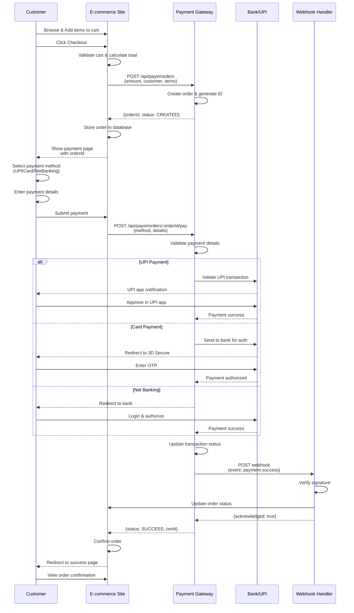
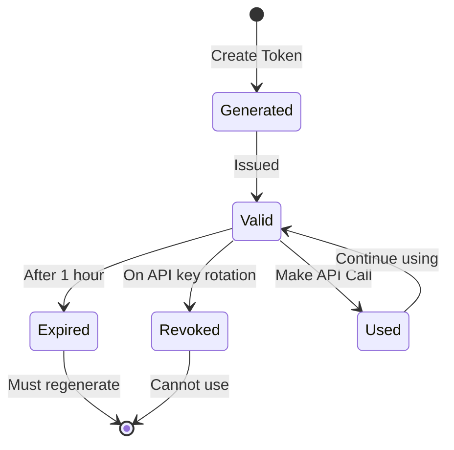
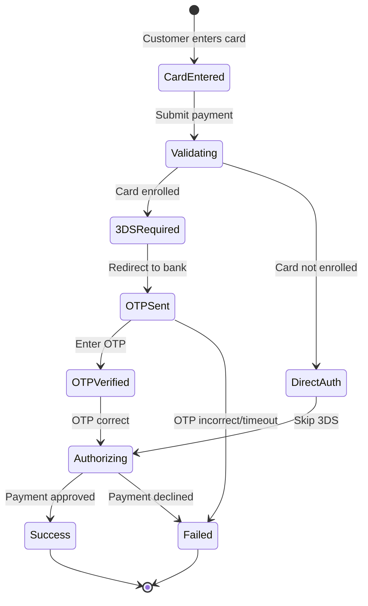
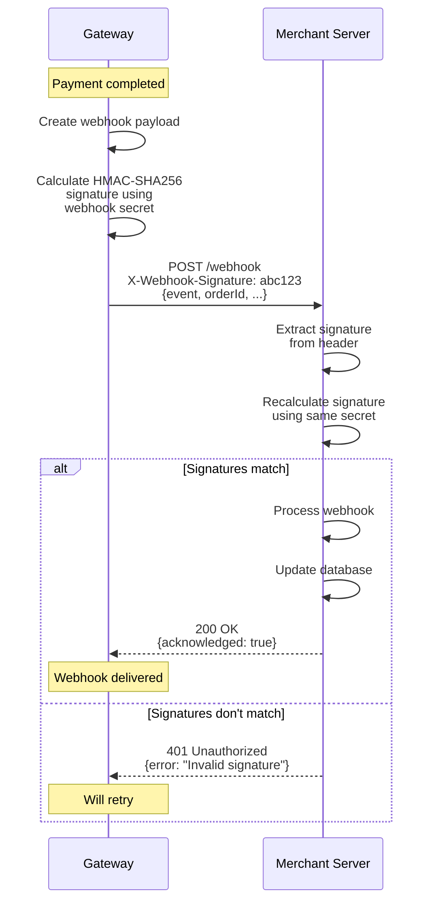
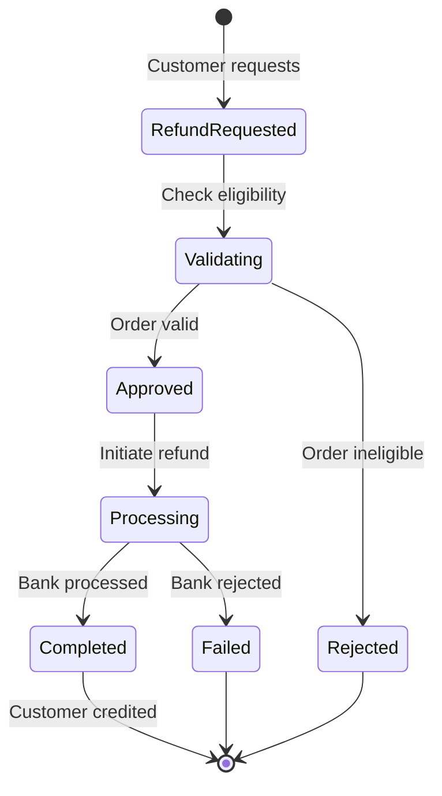
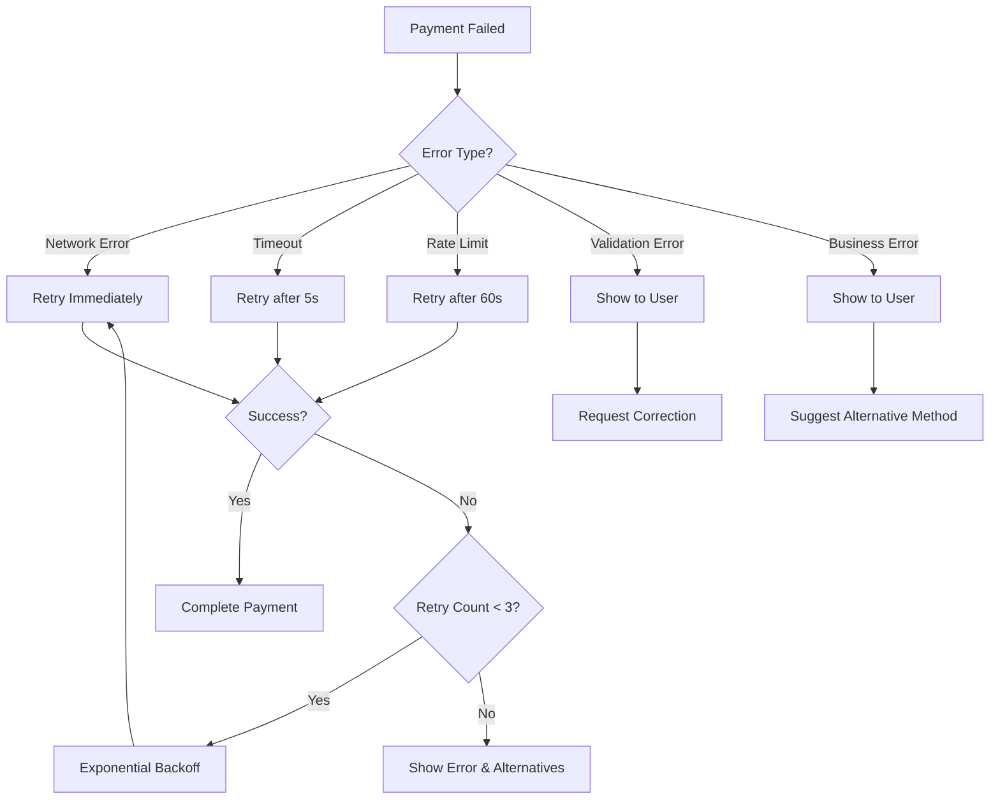

# Payment Flow Diagrams

This document provides detailed visual representations of various payment flows for e-commerce integration.

## Table of Contents
1. [Complete Payment Flow](#complete-payment-flow)
2. [Authentication Flow](#authentication-flow)
3. [UPI Payment Flow](#upi-payment-flow)
4. [Card Payment Flow](#card-payment-flow)
5. [Webhook Flow](#webhook-flow)
6. [Refund Flow](#refund-flow)
7. [Error Handling Flow](#error-handling-flow)

## Complete Payment Flow

### High-Level Overview

```
┌──────────────────────────────────────────────────────────────────────────────┐
│                        E-COMMERCE PAYMENT FLOW                                │
└──────────────────────────────────────────────────────────────────────────────┘

┌──────────┐     ┌───────────┐     ┌──────────┐     ┌──────────┐     ┌────────┐
│ Customer │     │ E-commerce│     │  Payment │     │  Payment │     │  Bank  │
│          │────>│  Website  │────>│  Gateway │────>│ Processor│────>│        │
└──────────┘     └───────────┘     └──────────┘     └──────────┘     └────────┘
     │                 │                  │                │               │
     │  Browse &       │                  │                │               │
     │  Add to Cart    │                  │                │               │
     │                 │                  │                │               │
     │  Checkout       │                  │                │               │
     │────────────────>│                  │                │               │
     │                 │                  │                │               │
     │                 │  Create Order    │                │               │
     │                 │─────────────────>│                │               │
     │                 │                  │                │               │
     │                 │  Order ID        │                │               │
     │                 │<─────────────────│                │               │
     │                 │                  │                │               │
     │  Payment Page   │                  │                │               │
     │<────────────────│                  │                │               │
     │                 │                  │                │               │
     │  Select Method  │                  │                │               │
     │  & Enter Details│                  │                │               │
     │                 │                  │                │               │
     │  Submit Payment │                  │                │               │
     │─────────────────────────────────────>               │               │
     │                 │                  │                │               │
     │                 │                  │  Process       │               │
     │                 │                  │───────────────>│               │
     │                 │                  │                │               │
     │                 │                  │                │  Authorize    │
     │                 │                  │                │──────────────>│
     │                 │                  │                │               │
     │                 │                  │                │  Auth Response│
     │                 │                  │                │<──────────────│
     │                 │                  │                │               │
     │                 │                  │  Result        │               │
     │                 │                  │<───────────────│               │
     │                 │                  │                │               │
     │                 │  Webhook         │                │               │
     │                 │<─────────────────│                │               │
     │                 │                  │                │               │
     │  Success Page   │                  │                │               │
     │<────────────────│                  │                │               │
     │                 │                  │                │               │
```

### Detailed Sequence Diagram



## Authentication Flow

### JWT Token Generation

```
┌────────────────────────────────────────────────────────────┐
│              JWT AUTHENTICATION FLOW                        │
└────────────────────────────────────────────────────────────┘

┌─────────────┐                           ┌──────────────┐
│  Merchant   │                           │   Gateway    │
│   Server    │                           │     API      │
└──────┬──────┘                           └───────┬──────┘
       │                                          │
       │  1. Generate JWT Token                  │
       │     with API Key & Secret               │
       │                                          │
       │  2. Make API Request                    │
       │     Authorization: Bearer <token>       │
       │─────────────────────────────────────────>│
       │                                          │
       │                                          │  3. Verify Token
       │                                          │     - Check signature
       │                                          │     - Validate expiry
       │                                          │     - Verify API key
       │                                          │
       │  4. Return Response                     │
       │     (or 401 if invalid)                 │
       │<─────────────────────────────────────────│
       │                                          │
```

### Token Lifecycle



## UPI Payment Flow

### UPI Collect Request Flow

```
┌──────────────────────────────────────────────────────────────────────────┐
│                        UPI COLLECT REQUEST FLOW                           │
└──────────────────────────────────────────────────────────────────────────┘

Customer          E-commerce         Gateway           UPI Switch        Customer
Mobile            Website             API               (NPCI)           UPI App
   │                 │                 │                   │                │
   │  1. Checkout    │                 │                   │                │
   │────────────────>│                 │                   │                │
   │                 │                 │                   │                │
   │                 │  2. Create      │                   │                │
   │                 │     Order       │                   │                │
   │                 │────────────────>│                   │                │
   │                 │                 │                   │                │
   │  3. Show        │                 │                   │                │
   │     Payment Page│                 │                   │                │
   │<────────────────│                 │                   │                │
   │                 │                 │                   │                │
   │  4. Enter       │                 │                   │                │
   │     UPI ID      │                 │                   │                │
   │                 │                 │                   │                │
   │  5. Submit      │                 │                   │                │
   │────────────────>│                 │                   │                │
   │                 │                 │                   │                │
   │                 │  6. Validate    │                   │                │
   │                 │     VPA         │                   │                │
   │                 │────────────────>│                   │                │
   │                 │                 │                   │                │
   │                 │                 │  7. Check VPA     │                │
   │                 │                 │──────────────────>│                │
   │                 │                 │                   │                │
   │                 │                 │  8. VPA Valid     │                │
   │                 │                 │<──────────────────│                │
   │                 │                 │                   │                │
   │                 │  9. Create      │                   │                │
   │                 │     Collect Req │                   │                │
   │                 │────────────────>│                   │                │
   │                 │                 │                   │                │
   │                 │                 │  10. Send Collect │                │
   │                 │                 │──────────────────>│                │
   │                 │                 │                   │                │
   │                 │                 │                   │  11. Push      │
   │                 │                 │                   │     Notification
   │                 │                 │                   │───────────────>│
   │                 │                 │                   │                │
   │                 │                 │                   │  12. Show      │
   │                 │                 │                   │      Request   │
   │                 │                 │                   │                │
   │  13. Approve in UPI App                              │                │
   │<─────────────────────────────────────────────────────────────────────>│
   │                 │                 │                   │                │
   │                 │                 │                   │  14. Approved  │
   │                 │                 │                   │<───────────────│
   │                 │                 │                   │                │
   │                 │                 │  15. Success      │                │
   │                 │                 │<──────────────────│                │
   │                 │                 │                   │                │
   │                 │  16. Webhook    │                   │                │
   │                 │<────────────────│                   │                │
   │                 │                 │                   │                │
   │  17. Success    │                 │                   │                │
   │     Page        │                 │                   │                │
   │<────────────────│                 │                   │                │
   │                 │                 │                   │                │
```

### UPI QR Code Flow

```
┌──────────────────────────────────────────────────────────────────────────┐
│                          UPI QR CODE FLOW                                 │
└──────────────────────────────────────────────────────────────────────────┘

Customer          E-commerce         Gateway           Customer           Bank
                  Website             API              UPI App
   │                 │                 │                   │                │
   │  1. Checkout    │                 │                   │                │
   │────────────────>│                 │                   │                │
   │                 │                 │                   │                │
   │                 │  2. Generate    │                   │                │
   │                 │     QR Code     │                   │                │
   │                 │────────────────>│                   │                │
   │                 │                 │                   │                │
   │                 │  3. QR Data     │                   │                │
   │                 │<────────────────│                   │                │
   │                 │                 │                   │                │
   │  4. Display     │                 │                   │                │
   │     QR Code     │                 │                   │                │
   │<────────────────│                 │                   │                │
   │                 │                 │                   │                │
   │  5. Open UPI    │                 │                   │                │
   │     App & Scan  │                 │                   │                │
   │─────────────────────────────────────────────────────>│                │
   │                 │                 │                   │                │
   │                 │                 │                   │  6. Parse QR & │
   │                 │                 │                   │     Show Details
   │                 │                 │                   │                │
   │  7. Confirm     │                 │                   │                │
   │     Payment     │                 │                   │                │
   │─────────────────────────────────────────────────────>│                │
   │                 │                 │                   │                │
   │                 │                 │                   │  8. Process    │
   │                 │                 │                   │     Payment    │
   │                 │                 │                   │───────────────>│
   │                 │                 │                   │                │
   │                 │                 │                   │  9. Success    │
   │                 │                 │                   │<───────────────│
   │                 │                 │                   │                │
   │                 │  10. Callback   │                   │                │
   │                 │<────────────────────────────────────│                │
   │                 │                 │                   │                │
   │  11. Success    │                 │                   │                │
   │<────────────────│                 │                   │                │
   │                 │                 │                   │                │
```

## Card Payment Flow

### 3D Secure Authentication

```
┌──────────────────────────────────────────────────────────────────────────┐
│                      CARD PAYMENT WITH 3D SECURE                          │
└──────────────────────────────────────────────────────────────────────────┘

Customer          E-commerce         Gateway           Bank              Card
                  Website             API              ACS              Network
   │                 │                 │                │                 │
   │  1. Enter Card  │                 │                │                 │
   │     Details     │                 │                │                 │
   │────────────────>│                 │                │                 │
   │                 │                 │                │                 │
   │                 │  2. Submit      │                │                 │
   │                 │     Payment     │                │                 │
   │                 │────────────────>│                │                 │
   │                 │                 │                │                 │
   │                 │                 │  3. Validate   │                 │
   │                 │                 │     Card Info  │                 │
   │                 │                 │                │                 │
   │                 │                 │  4. Check      │                 │
   │                 │                 │     3DS Enroll │                 │
   │                 │                 │────────────────────────────────>│
   │                 │                 │                │                 │
   │                 │                 │  5. Enrolled   │                 │
   │                 │                 │<────────────────────────────────│
   │                 │                 │                │                 │
   │                 │                 │  6. Init 3DS   │                 │
   │                 │                 │───────────────>│                 │
   │                 │                 │                │                 │
   │                 │  7. Redirect    │                │                 │
   │                 │     to ACS      │                │                 │
   │                 │<────────────────│                │                 │
   │                 │                 │                │                 │
   │  8. Redirect    │                 │                │                 │
   │<────────────────│                 │                │                 │
   │                 │                 │                │                 │
   │  9. Show OTP    │                 │                │                 │
   │     Page        │                 │                │                 │
   │<────────────────────────────────────────────────────────────────────│
   │                 │                 │                │                 │
   │  10. Enter OTP  │                 │                │                 │
   │─────────────────────────────────────────────────────────────────────>│
   │                 │                 │                │                 │
   │                 │                 │  11. Verify    │                 │
   │                 │                 │      OTP       │                 │
   │                 │                 │<───────────────│                 │
   │                 │                 │                │                 │
   │                 │                 │  12. Authorize │                 │
   │                 │                 │      Payment   │                 │
   │                 │                 │────────────────────────────────>│
   │                 │                 │                │                 │
   │                 │                 │  13. Success   │                 │
   │                 │                 │<────────────────────────────────│
   │                 │                 │                │                 │
   │                 │  14. Return     │                │                 │
   │                 │      to Site    │                │                 │
   │<────────────────────────────────────────────────────────────────────│
   │                 │                 │                │                 │
   │                 │  15. Webhook    │                │                 │
   │                 │<────────────────│                │                 │
   │                 │                 │                │                 │
   │  16. Success    │                 │                │                 │
   │     Page        │                 │                │                 │
   │<────────────────│                 │                │                 │
   │                 │                 │                │                 │
```

### Card Payment State Machine



## Webhook Flow

### Webhook Delivery Mechanism

```
┌──────────────────────────────────────────────────────────────────────────┐
│                         WEBHOOK DELIVERY FLOW                             │
└──────────────────────────────────────────────────────────────────────────┘

Gateway                        Merchant                         Merchant
Event                         Webhook                          Application
System                        Endpoint                         Database
   │                             │                                 │
   │  1. Payment Event           │                                 │
   │     (Success/Fail)          │                                 │
   │                             │                                 │
   │  2. Generate Webhook        │                                 │
   │     Payload                 │                                 │
   │                             │                                 │
   │  3. Calculate HMAC          │                                 │
   │     Signature               │                                 │
   │                             │                                 │
   │  4. POST Webhook            │                                 │
   │     with Signature          │                                 │
   │────────────────────────────>│                                 │
   │                             │                                 │
   │                             │  5. Verify Signature            │
   │                             │                                 │
   │                             │  6. Process Webhook             │
   │                             │                                 │
   │                             │  7. Update Order                │
   │                             │────────────────────────────────>│
   │                             │                                 │
   │                             │  8. Order Updated               │
   │                             │<────────────────────────────────│
   │                             │                                 │
   │                             │  9. Send Email                  │
   │                             │     Confirmation                │
   │                             │                                 │
   │                             │  10. Return 200 OK              │
   │  11. Webhook                │      {acknowledged: true}       │
   │      Acknowledged           │                                 │
   │<────────────────────────────│                                 │
   │                             │                                 │
   │  12. Mark Delivered         │                                 │
   │                             │                                 │

IF WEBHOOK FAILS:

Gateway                        Merchant
Event                         Webhook
System                        Endpoint
   │                             │
   │  POST Webhook               │
   │────────────────────────────>│
   │                             │
   │  ❌ Connection Error or     │
   │     Non-200 Response        │
   │<────────────────────────────│
   │                             │
   │  Wait 1 minute              │
   │  (Exponential Backoff)      │
   │                             │
   │  Retry 1: POST Webhook      │
   │────────────────────────────>│
   │                             │
   │  ❌ Still Failing           │
   │                             │
   │  Wait 2 minutes             │
   │                             │
   │  Retry 2: POST Webhook      │
   │────────────────────────────>│
   │                             │
   │  ❌ Still Failing           │
   │                             │
   │  Wait 5 minutes             │
   │                             │
   │  Retry 3: POST Webhook      │
   │────────────────────────────>│
   │                             │
   │  ... (up to 10 retries)     │
   │                             │
```

### Webhook Security Flow



## Refund Flow

### Full Refund Process

```
┌──────────────────────────────────────────────────────────────────────────┐
│                           REFUND FLOW                                     │
└──────────────────────────────────────────────────────────────────────────┘

Customer          E-commerce         Gateway           Bank/            Customer
Support           Admin               API              Processor         Account
   │                 │                 │                   │                │
   │  1. Request     │                 │                   │                │
   │     Refund      │                 │                   │                │
   │────────────────>│                 │                   │                │
   │                 │                 │                   │                │
   │                 │  2. Verify      │                   │                │
   │                 │     Order       │                   │                │
   │                 │                 │                   │                │
   │                 │  3. Check       │                   │                │
   │                 │     Eligibility │                   │                │
   │                 │                 │                   │                │
   │                 │  4. Initiate    │                   │                │
   │                 │     Refund      │                   │                │
   │                 │────────────────>│                   │                │
   │                 │                 │                   │                │
   │                 │                 │  5. Validate      │                │
   │                 │                 │     Transaction   │                │
   │                 │                 │                   │                │
   │                 │                 │  6. Process       │                │
   │                 │                 │     Refund        │                │
   │                 │                 │──────────────────>│                │
   │                 │                 │                   │                │
   │                 │                 │  7. Refund        │                │
   │                 │                 │     Initiated     │                │
   │                 │                 │<──────────────────│                │
   │                 │                 │                   │                │
   │                 │  8. Refund ID   │                   │                │
   │                 │<────────────────│                   │                │
   │                 │                 │                   │                │
   │  9. Notify      │                 │                   │                │
   │     Customer    │                 │                   │                │
   │<────────────────│                 │                   │                │
   │                 │                 │                   │                │
   │                 │                 │                   │  (3-7 days)    │
   │                 │                 │                   │                │
   │                 │                 │  10. Refund       │                │
   │                 │                 │      Completed    │                │
   │                 │                 │<──────────────────│                │
   │                 │                 │                   │                │
   │                 │  11. Webhook    │                   │  12. Credit    │
   │                 │      Notify     │                   │      Account   │
   │                 │<────────────────│                   │───────────────>│
   │                 │                 │                   │                │
   │                 │  13. Update     │                   │                │
   │                 │      Order      │                   │                │
   │                 │                 │                   │                │
   │  14. Send       │                 │                   │                │
   │      Email      │                 │                   │                │
   │<────────────────│                 │                   │                │
   │                 │                 │                   │                │
```

### Refund State Diagram



## Error Handling Flow

### Payment Failure Handling

```
┌──────────────────────────────────────────────────────────────────────────┐
│                      PAYMENT ERROR HANDLING                               │
└──────────────────────────────────────────────────────────────────────────┘

                Payment Attempt
                      │
                      ▼
            ┌─────────────────┐
            │  Process Payment│
            └────────┬────────┘
                     │
          ┌──────────┴──────────┐
          │                     │
          ▼                     ▼
    ┌──────────┐          ┌──────────┐
    │ SUCCESS  │          │  FAILURE │
    └──────────┘          └─────┬────┘
                                │
                      ┌─────────┴─────────┐
                      │  Analyze Error     │
                      └─────────┬─────────┘
                                │
              ┌─────────────────┼─────────────────┐
              │                 │                 │
              ▼                 ▼                 ▼
    ┌──────────────┐  ┌──────────────┐  ┌──────────────┐
    │  Network     │  │  Validation  │  │  Business    │
    │  Error       │  │  Error       │  │  Error       │
    └──────┬───────┘  └──────┬───────┘  └──────┬───────┘
           │                 │                 │
           ▼                 ▼                 ▼
    ┌──────────────┐  ┌──────────────┐  ┌──────────────┐
    │  Retry with  │  │  Show Error  │  │  Show Error  │
    │  Backoff     │  │  to Customer │  │  & Options   │
    └──────┬───────┘  └──────────────┘  └──────┬───────┘
           │                                    │
           │                                    ▼
           │                          ┌──────────────────┐
           │                          │  Suggest         │
           │                          │  Alternative     │
           │                          │  Payment Method  │
           │                          └──────────────────┘
           │
           ▼
    ┌──────────────┐
    │  Success or  │
    │  Max Retries │
    └──────────────┘
```

### Retry Strategy Flow



## Status Polling Flow

### Payment Status Check

```
┌──────────────────────────────────────────────────────────────────────────┐
│                      PAYMENT STATUS POLLING                               │
└──────────────────────────────────────────────────────────────────────────┘

Customer          E-commerce         Gateway
Browser           Frontend            API
   │                 │                 │
   │  Payment        │                 │
   │  Initiated      │                 │
   │                 │                 │
   │  Show Loading   │                 │
   │<────────────────│                 │
   │                 │                 │
   │                 │  Poll Status    │
   │                 │  (every 3s)     │
   │                 │────────────────>│
   │                 │                 │
   │                 │  Status:        │
   │                 │  PROCESSING     │
   │                 │<────────────────│
   │                 │                 │
   │                 │  Wait 3 seconds │
   │                 │                 │
   │                 │  Poll Status    │
   │                 │────────────────>│
   │                 │                 │
   │                 │  Status:        │
   │                 │  PROCESSING     │
   │                 │<────────────────│
   │                 │                 │
   │                 │  Wait 3 seconds │
   │                 │                 │
   │                 │  Poll Status    │
   │                 │────────────────>│
   │                 │                 │
   │                 │  Status:        │
   │                 │  SUCCESS        │
   │                 │<────────────────│
   │                 │                 │
   │  Redirect to    │                 │
   │  Success Page   │                 │
   │<────────────────│                 │
   │                 │                 │

Polling Strategy:
- Poll every 3 seconds
- Max polling time: 10 minutes
- Use exponential backoff after 1 minute
- Stop polling on SUCCESS or FAILED status
```

---

## Integration Patterns

### Pattern 1: Direct Integration

```
E-commerce → Gateway API → Bank/UPI
(Merchant handles all UI)
```

### Pattern 2: Redirect Integration

```
E-commerce → Gateway Hosted Page → Bank/UPI → Redirect Back
(Gateway handles payment UI)
```

### Pattern 3: SDK Integration

```
E-commerce (with SDK) → Gateway API → Bank/UPI
(SDK handles API calls and UI)
```

---

**Last Updated**: January 2024
**Version**: 1.0.0
